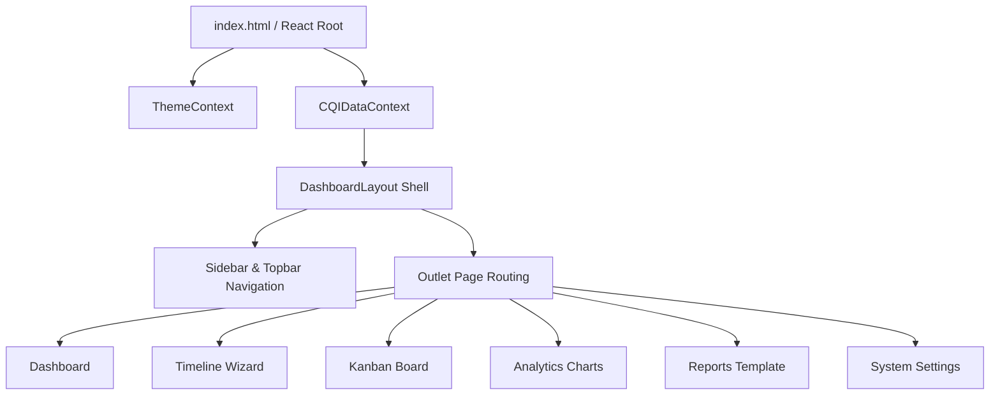

# CQI Outcome Analytics Tracker

A Continuous Quality Improvement (CQI) dashboard and accreditation tracking system conforming to Outcome-Based Education (OBE) and NBA (National Board of Accreditation) Tier-1 specifications.

Somaiya Vidyavihar University uses this dashboard to monitor curriculum attainment trends, identify course outcome (CO) gaps, coordinate corrective audits, and export NBA audit trail logs.

---

## 🏛️ System Architecture

The application is structured as a client-side Single Page Application (SPA). Because it operates offline, the client state layer acts as the source of truth, persisting directly to localStorage:



### Key Technical Blocks:
* **Reactive Context Layer (`CQIDataContext.jsx`)**: Centralizes the state tree. Handles mutations (CRUD) for actions, syncs logs, parses cached payloads, and automatically repairs local storage if corrupted.
* **Component Design System**: Restricts element styling to standard institutional variable tokens (`src/styles/design-tokens.css` and `src/styles/theme-dark.css`) mapped dynamically in `tailwind.config.js`.
* **Chart Syncing Module**: Repaints Chart.js line, bar, and doughnut components instantly when the user toggles dark mode, redrawing axes lines to ensure contrast compliance.
* **Print Engine Layouts**: Uses `@media print` CSS overrides to format summary pages for A4 PDF printing, hiding navigation menus, filter forms, and buttons.

---

## 🛠️ Tech Stack & Dependencies

- **Core**: React v18 + Vite (SPA routing via `react-router-dom` v6)
- **Styling**: Tailwind CSS v3 (bridged to design token custom properties)
- **Visualizations**: Chart.js v4 (via `react-chartjs-2`)
- **Animation Layer**:
  - **Framer Motion**: Manages card expands, modal overlays, and layout switches.
  - **AOS (Animate On Scroll)**: Manages card grids, line charts, and report layouts.
- **Iconography**: Lucide React

---

## 🚀 Setup & Execution

### 1. Installation
Install project dependencies:
```bash
npm install
```

### 2. Development Execution
Start the local development server:
```bash
npm run dev
```

### 3. Compilation & Build Validation
Verify production assets bundle optimization and run linter checks:
```bash
npm run build
npm run lint
```

---

## 🔒 Security & Accessibility Hardening

Conforming to accessibility standards and client security guidelines:
1. **XSS Protection**: Assures safe rendering. The codebase contains **zero** instances of `dangerouslySetInnerHTML`. All input values are bound to text nodes.
2. **Formula Injection Sanitization**: Neutralizes spreadsheet formula indicators (`=`, `+`, `-`, `@`) in cells during CSV generation to protect downstream Excel files.
3. **Parse Resilience**: Wraps storage parsing in try/catch bounds with strict schema checks. If local cache contains malformed JSON or invalid schema primitives, it falls back to seeded defaults.
4. **Modal Dialog Access**: Modal windows trap keyboard focus. Tabbing cycles strictly within the modal boundaries, and closing restores focus to the triggering element.
5. **Reduced Motion**: Disables animation durations globally if the client prefers reduced motion (`@media (prefers-reduced-motion: reduce)`).
6. **Color Contrast Compliance**: Meets WCAG AA requirements:
   - Primary Text contrast: **15.8:1**
   - Secondary Text contrast: **7.55:1** (Light) / **9.69:1** (Dark)
   - Tertiary Text contrast: **7.5:1** (Light) / **6.26:1** (Dark)

---

## 📄 License

Distributed under the MIT License. See [LICENSE](file:///c:/Users/yojit/Documents/New%20folder/cqi-tracker/LICENSE) for more details.
