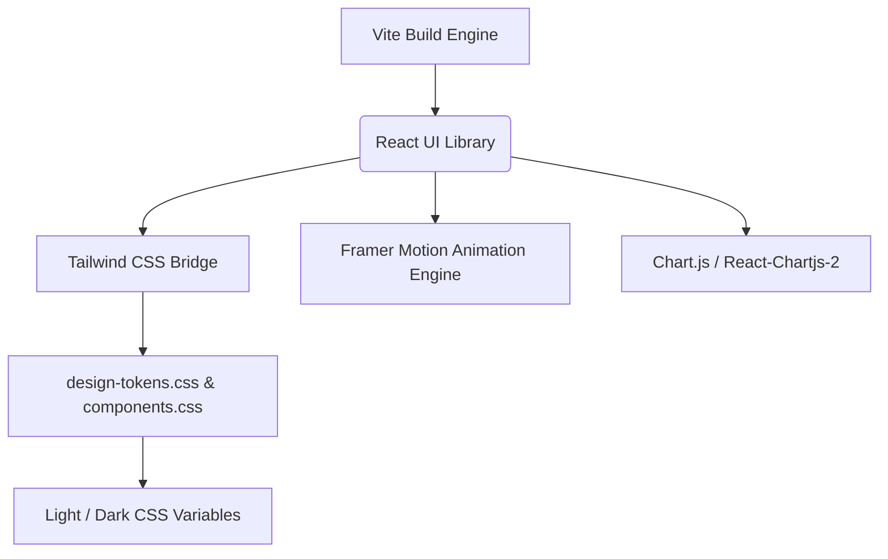
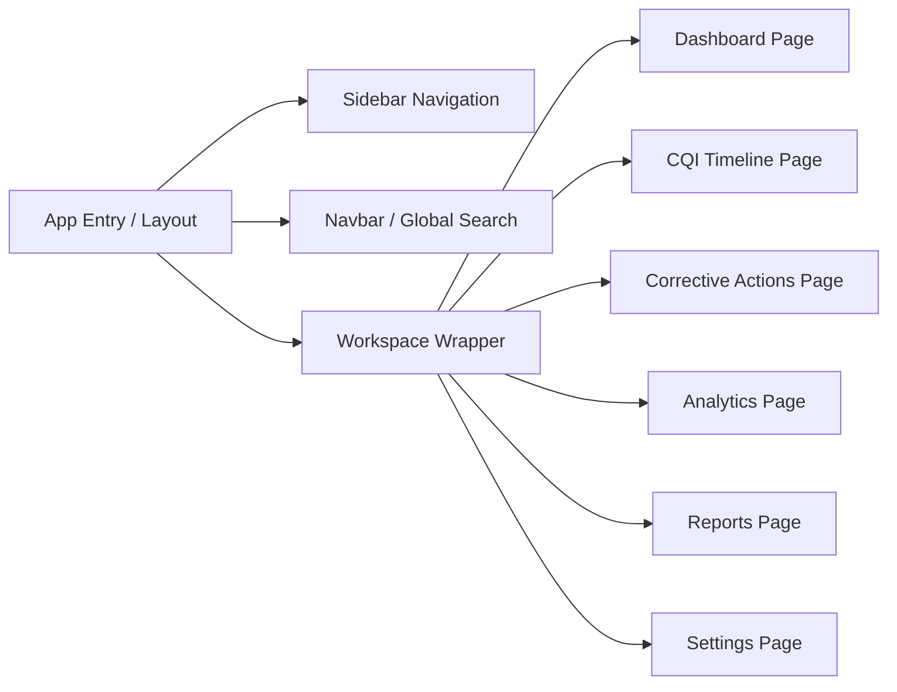
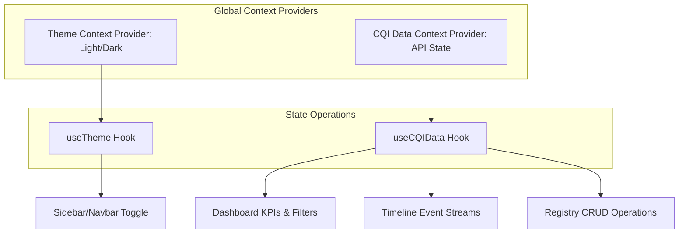

# Detailed Project Architecture Document
## CQI Tracker UI Architecture and Data Flows

This document details the frontend architecture, state management patterns, routing configuration, charting framework setup, and interactive animations for the **Continuous Quality Improvement (CQI) Tracker UI**.

---

## 1. System Context & Tech Stack Integration

The CQI Tracker is designed as a single-page application (SPA) built using React, Vite, Tailwind CSS, Framer Motion, and Chart.js. 



### Stack Roles:
1.  **Vite**: The build container and development environment. Optimized for rapid hot-module reloading (HMR) and roll-up compilation.
2.  **React (v18+)**: Component-based user interface management, utilizing state, custom hooks, and functional components.
3.  **Tailwind CSS**: Utility class framework. Bridges utility styling to the design tokens so spacing and color metrics remain unified.
4.  **Framer Motion**: Controls micro-animations, layout shifts, modals, sidebar slide-ins, and step wizard transitions.
5.  **Chart.js (via react-chartjs-2)**: Powers academic outcomes analytics, timeline trends, corrective action rates, and program diagnostics charts.

---

## 2. Directory and Folder Architecture

The folder structure is organized by feature areas, style hierarchies, and global contexts.

```text
cqi-tracker/
├── .github/                 # GitHub workflows for CI/CD and deployment
├── docs/                    # Architecture and Design System documentation
│   ├── architecture.md
│   ├── design_system.md
│   ├── component_inventory.md
│   ├── wireframes.md
│   └── roadmap_and_risks.md
├── public/                  # Static assets (favicons, SVU logo files)
├── src/
│   ├── assets/              # Inline SVGs, background illustrations
│   ├── components/          # Reusable shared UI kit components
│   │   ├── common/          # Atomic components (Buttons, Badges, Dropdowns, Inputs)
│   │   ├── layout/          # Layout blocks (Sidebar, Navbar, MainWrapper)
│   │   ├── feedback/        # Modals, ToastNotification, AlertBanner
│   │   ├── data/            # TableContainer, TimelineFeed, SegmentedControl
│   │   └── charts/          # Chart wrappers (TrendChart, DistributionChart)
│   ├── context/             # Global contexts (ThemeContext, CQIDataContext)
│   ├── hooks/               # Custom React hooks (useTheme, useCorrectiveActions)
│   ├── pages/               # Page containers matching the router structure
│   │   ├── Dashboard/
│   │   ├── Timeline/
│   │   ├── CorrectiveActions/
│   │   ├── Analytics/
│   │   ├── Reports/
│   │   └── Settings/
│   ├── styles/              # Global and overridden CSS files
│   │   ├── index.css        # Tailwind directives + main entry
│   │   ├── design-tokens.css# Core SVU design variables (mandatory)
│   │   ├── components.css   # SVU styled components (mandatory)
│   │   └── theme-dark.css   # Proposed Dark Mode overrides
│   ├── utils/               # Formatting, dates, metrics calculation
│   ├── App.jsx              # Main App entry with Routing and Context Providers
│   └── main.jsx             # React DOM bootstrapping
├── tailwind.config.js       # Tailwind configuration file containing SVU tokens
├── vite.config.js           # Vite server, aliases, and building instructions
└── package.json             # NPM dependencies registry
```

---

## 3. Page Architecture & Routing Strategy

The application uses **React Router DOM v6** to manage client-side routing. All pages render within a layout block that coordinates sidebar states and navigation.



### Route Index Registry:
*   `/dashboard`: High-level summary of quality index scores, program performance indicators, alert banners, and active action items.
*   `/timeline`: The Outcome-Based Education (OBE) timeline illustrating corrective audit flows, accreditation updates, and academic progress steps.
*   `/corrective-actions`: The registry table for creating, updating, assigning, and executing corrective measures (e.g., closing syllabus gaps).
*   `/analytics`: Deep-dive data graphs comparing programs, highlighting outcome mappings, and measuring performance metrics.
*   `/reports`: Generates PDFs and spreadsheets containing CQI status logs, departmental audits, and university accreditation summaries.
*   `/settings`: Configures quality boundaries, department scopes, academic year parameters, and dark/light modes.

---

## 4. Application State Management Architecture

To keep the application highly responsive and preserve data consistency, a modular state architecture is implemented.



### A. Global State Providers
1.  **`ThemeContext`**:
    *   *State:* `theme` ('light' | 'dark').
    *   *Operations:* `toggleTheme()`.
    *   *Implementation:* Writes the selected theme as an attribute on the `<html>` tag (`data-theme="light" | "dark"`) and caches the setting in local storage.
2.  **`CQIDataContext`**:
    *   *State:* Cache of academic departments, active corrective actions, timeline audit trails, and KPI scorecards.
    *   *Operations:* Fetch data from API, filter by department/semester, add action items, progress timeline statuses.

### B. Local Component UI State
*   **Segmented Controls:** Controlled using local selection hooks. Updates visible subsets instantly.
*   **Wizard & Modals:** Local state controls visibility and step sequences, ensuring immediate DOM mounts and clean animations.

---

## 5. Chart.js Style & Theme Synchronization

A common pitfall is that standard canvas charts do not automatically respond to CSS variable overrides when toggling themes. We resolve this by binding the Chart.js global config to the computed CSS variables of the page.

### Configuration Bridge for Chart.js:
When initializing graphs, we read the exact CSS custom variables from the DOM using a utility script so that the chart text, grids, and lines stay in sync with the current theme.

```javascript
// src/utils/chartHelpers.js
export const getDesignTokens = () => {
  const styles = getComputedStyle(document.documentElement);
  return {
    primary: styles.getPropertyValue('--color-primary').trim() || '#b7202e',
    secondary: styles.getPropertyValue('--color-secondary').trim() || '#d97706',
    success: styles.getPropertyValue('--color-success').trim() || '#059669',
    error: styles.getPropertyValue('--color-error').trim() || '#dc2626',
    border: styles.getPropertyValue('--color-border').trim() || '#c5cacf',
    textPrimary: styles.getPropertyValue('--color-text-primary').trim() || '#231f20',
    textSecondary: styles.getPropertyValue('--color-text-secondary').trim() || '#58595b',
    fontFamily: styles.getPropertyValue('--font-body').trim() || 'Inter',
  };
};

export const applyChartThemeDefaults = (Chart) => {
  const tokens = getDesignTokens();
  
  // Set Chart.js Globals
  Chart.defaults.font.family = tokens.fontFamily;
  Chart.defaults.font.size = 12;
  Chart.defaults.color = tokens.textSecondary;
  
  // Grid configuration
  Chart.defaults.scale.grid.color = tokens.border;
  Chart.defaults.scale.grid.borderColor = tokens.border;
};
```
Whenever the theme toggles, the charts will call a redraw hook to reload current tokens and redraw the grid lines.

---

## 6. Framer Motion Animation Specification

To build a premium visual experience, animations should be subtle, meaningful, and utilize the design system's transition curves.

### A. Transition Curves Mapped
*   **Fast Transition:** Duration: `0.12s`, easing: `[0.4, 0, 0.2, 1]` (custom cubic-bezier). Used for button states, links, checkboxes.
*   **Normal Transition:** Duration: `0.22s`, easing: `[0.4, 0, 0.2, 1]`. Used for page changes, sidebar expansions, and panel transitions.
*   **Slow Transition:** Duration: `0.38s`, easing: `[0.4, 0, 0.2, 1]`. Used for opening modals, sliding alerts, and timeline progress.

### B. Core Animation Variants

#### 1. Page / Panel Transitions (Fade In & Slide Up)
```javascript
export const pageTransitionVariants = {
  initial: { opacity: 0, y: 10 },
  animate: { 
    opacity: 1, 
    y: 0,
    transition: { duration: 0.22, ease: [0.4, 0, 0.2, 1] } 
  },
  exit: { 
    opacity: 0, 
    y: -10, 
    transition: { duration: 0.12, ease: [0.4, 0, 0.2, 1] } 
  }
};
```

#### 2. Sidebar Navigation Hover Indicator (Layout Animation)
When hover transitions between navigation items, we use Framer Motion's `layoutId` to animate a colored underline or capsule background smoothly from one link to the next.

#### 3. Modal Dialog backdrop & Content Bounce
*   **Backdrop Mask:** Fade in opacity `0` to `1` over `0.22s`.
*   **Modal Container:** Scale up `0.92` to `1.0` with a slide effect, providing a tactile, premium mounting feel.

#### 4. Timeline Event Feeds (Incremental Slide-in)
As timeline items render, they stagger in sequence.
```javascript
export const staggerContainer = {
  animate: {
    transition: {
      staggerChildren: 0.08
    }
  }
};

export const timelineItemVariants = {
  initial: { opacity: 0, x: -16 },
  animate: { 
    opacity: 1, 
    x: 0,
    transition: { duration: 0.22, ease: "easeOut" }
  }
};
```
These specifications ensure a polished, cohesive visual presentation across the entire application interface.
